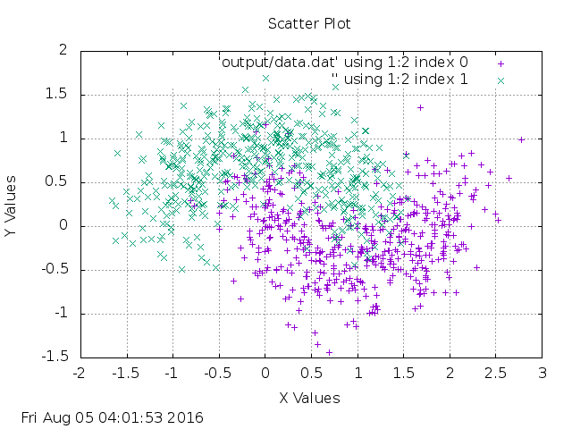

# Datasets

Generate sample datasets similar to sklearn.datasets in python

## Use

Currently only the make_moons method is implemented

```
iex> Datasets.make_moons()
```
Will create a dataset that looks like:


```
iex> Datasets.make_moons(100, true, 0.3)
```
Will create a dataset that looks like:


```
iex> Datasets.make_moons(1000, true, 0.3)
```
Will create a dataset that looks like:




## Installation

If [available in Hex](https://hex.pm/docs/publish), the package can be installed as:

  1. Add datasets to your list of dependencies in `mix.exs`:

        def deps do
          [{:datasets, "~> 0.1.0"}]
        end

  2. Ensure datasets is started before your application:

        def application do
          [applications: [:datasets]]
        end

